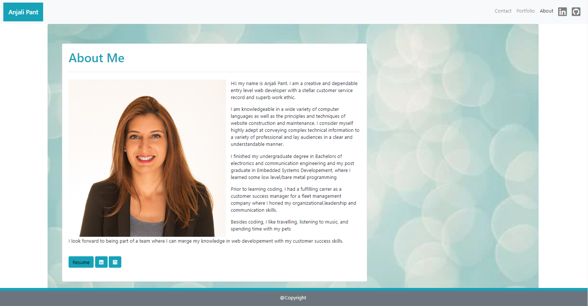
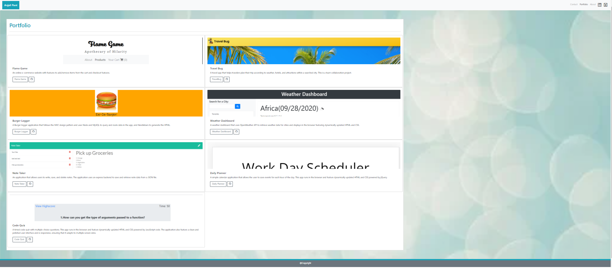

# Responsive-Portfolio

## Description

The project was to build a mobile responsive portfolio with my personal details featuring project-1 and project-2 and some exemplery homework assignments.

The webpage renders well on variety of devices and windows or screen sizes.The webiste is developed utlizing Bootstrap componenets and grid system.

## Technologies used

- HTML5
- CSS
- Bootstrap

## Features

- Website has navigation bars to toggle between Conatct page, portfolio page, About page, Linkedin and Github profile. Changed linkedin and github links to shows the icons.

- Website is designed with assistive technologies like links to my resume,github repositories and deployed applications as well as graphics and images demonstrating project UI making it accessible for everyone.

- Website uses Bootstrap as a framework to help design the website faster and easier. It includes HTML and CSS based design templates for typography, forms, buttons, tables, navigation, modals, image carousels, etc. 

- Website consists of intuitive design, easy navigation and relevant content.

- Webiste uses custom CSS to style the footer.

Click the link below to view the deployed application 

[Github Page](https://anjali9293.github.io/Updated-Portfolio-2/.)

## Contributers

- **[Anjali Pant](https://github.com/Anjali9293)** - *Index,Contact,Portfolio Development*

